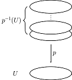

### covering space  (hatcher)
space X is a space $\widetilde{X}$ w/ a map $p: \widetilde{X} \rightarrow X$ s.t.:
* $x\in X$ has an open neighborhood $U \subseteq X$
* $p^{-1}(U)$ is a union of disjoint [[open-set|open sets]] in $\widetilde{X}$  
    
    - source: wiki
    - $p^{-1}(U)$ are discrete fibers
* each of which is mapped [[homeomorphism|homeomorphically]] onto U by $p$
* X is the base space, $\widetilde{X}$ is the covering space (Spanier)
* * covering projection $p$ is the [[fibrations|fibration]] (spanier)
- p is akin to $\pi: E \rightarrow B$ in [[fiber-bundle]] (http://rin.io/galois/)