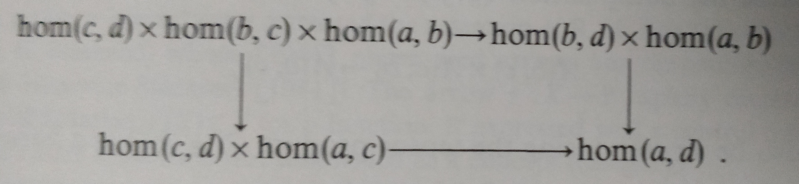
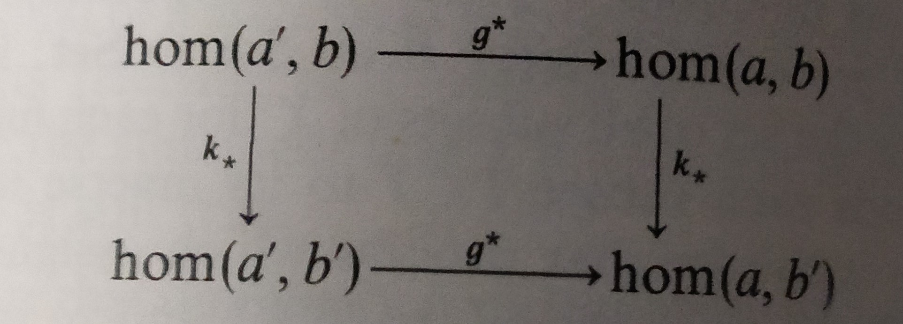

### hom sets (Mac Lane)
- objects $a, b \in C$
- hom-set $hom_C(a,b) = \{f|f:a\rightarrow b \in C\}$ consists of all arrows of the [[categories|category]] with 
  - domain $a$
  - codomain $b$
- notation: $hom_C(a,b) = C(a,b)=hom(a,b)=(a,b)=(a,b)_{C}$

category defined via hom, category w/ data:
- set of objects a, b,
- function which assigns to each ordered pair $<a,b>$ of objects a set $hom(a,b)$
- composition on ordered triple $<a,b,c>$ (associativity)
  - $hom(b,c) \times hom(a,b) \rightarrow hom(a,c)$
  - notation: $<g,f>\mapsto g\circ f$ for  $g\in hom(b,c), f\in hom(a,b)$
- identity: for each $b$, $1_b \in hom(b,b)$ (unit)
- disjointedness: if $<a,b> \neq <a^{\prime}, b^{\prime}>$ then $hom(a,b)\cap hom(a^{\prime}, b^{\prime})=\varnothing$
- associativity axiom: 

[[functors]] (Milewski):
- faithful: injective on hom sets
- full: surjective on hom sets

hom functor (Mac Lane)
- category C w/ small hom-sets: $hom(a,b) = \{f|f:a\rightarrow b, a,b \in C \}$
- object $a \in C$
- [[functors|functors]] $C(a, -) = hom(a, -): C \rightarrow \textbf{Set}$
  - object function sends each object $b \rightarrow hom(a,b)$
  - arrow function $k:b\rightarrow b^{\prime}$ to $hom(a,k): hom(a,b) \rightarrow hom(a,b^{\prime}$)
    - $f \mapsto k \circ f$

[[contravariant-functors| contravariant]] hom functor (Mac Lane)
- $C(-, b) = hom(-, b): C^{op} \rightarrow \textbf{Set}$
  - object $a \rightarrow hom(a,b)$
  - arrow $g: a \rightarrow a^{\prime}$ to $hom(g,b): hom(a^{\prime},b) \rightarrow hom(a,b)$ (prime first 'cause contravariant/reversed)
      - $f \mapsto f \circ g$ 

notation (Mac Lane):
- $k_* = hom(a,k)$
- $g^* = hom(g,b)$

