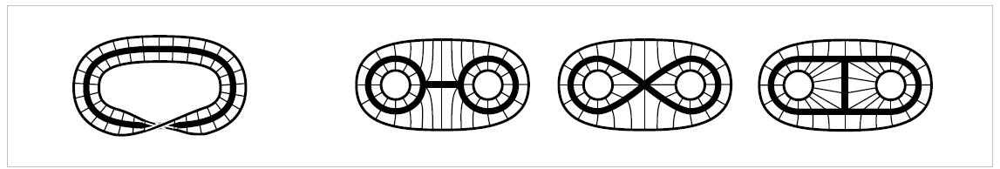

### homotopy 
classifying [[topological-space|topological spaces]] and [[continous-map|continous maps]]

have the same shape  (Hatcher):
  
  - mobius strip retracts to center, 
  - disk w/ two holes can be brokwen down into 3 subspaces in 3 different ways
  - all [[retract-deform|deformation retracts]] of same space but not each other
two spaces $X$ and $Y$ are homotopy equivalent (have same homotopy type) iff their is a Z that contains X and Y as deformation retracts. 

- homotopy category (Spanier)
  - objects are [[topological-space|topological spaces]] 
  - morphisms: equivalence classes of continuous maps 
  - maps are equivalent if one can be continuously [[retract-deform|deformed]] into the other
  -  given space X and subspace $A\subset X$, pair(X,A)
  -  map $f:(X,A)\rightarrow (Y,B)$ s.t.  $f(A) \subset B$

- $(X,A)\times I$ denotes $(X\times I, A \times I)$, 
- I is the unit interval [0,1] (hatcher)
- $X^{\prime}\subset X$ 
- $f_0, f_1: (X, A) \rightarrow (Y,B)$
- $f_0|X^{\prime} = f_1|X^{\prime}$  

homotopic functions: (Spanier)
$f_0$ is homotopic to $f_1$ relative to $X^{\prime}$, denoted $f_0 \cong f_1$ rel $X^{\prime}$, 
if there exists a map $F:(X,A)\times I \rightarrow (Y,B)$, F is called a homotopy relative to $X^{\prime}$  
s.t.  $F(x,0) = f_0(x)$ and $F(x,1) = f_1(x)$ for $x\in X$ & $F(x,t) = f_0(x)$, $x\in X^{\prime}, t\in I$
$f_0 \cong f_1$ rel $X^{\prime}$ corresponds to the intuitive idea of continuously deforming $f_0$ into $f_1$ by maps that all agree on $X^{\prime}$. 

homotopy (hatcher)
family of maps $f_t:X\rightarrow Y, t \in I$ s.t. $F\times I \rightarrow Y$ is continuous, $F(x,t) = f_t(x)$
$f_0, f_1: X \rightarrow Y$ are homotopic if there exists a homotopy $f_t$ connecting them s.t $f_0 \cong f_1$ 

homotopy-type (Wolfram)
class formed by sets w/ the same structure
Pairs (X,A), (Y,B) have the same homotype if they are equivalent in the homotopy category, meaning there exists 
- $f: X\rightarrow Y$, $g: Y\rightarrow X$ .s.t $g \circ f: X\rightarrow X$ and $f \circ g: Y\rightarrow Y$ are homotopic to the identity maps on X and Y, meaning they can be reduced to them via continuous deformations
$f:X\rightarrow Y$, spaces are said to be homotopy equivalent if they have the same homotopy-type

Theorems: (Spanier)
- homotopy relative to $X^{\prime}$ is an equivalence relation in the set of maps from $(X,A)$ to (Y,B)$ 
- composites of homotopic maps are homotopic
- any two maps of an arbitrary space to a [[contractable-space]] are homotopic
- a space is contractable iff it has the same homotopy type as a one-point space
corollary: two contractible spaces have the same homotopy type and any continuous map between them is a homotopy equivalence
- two spaces X and Y have the same homotopy type iff then can be imbedded as weak [[retract-deform| deformation retracts]] of the same space Z
