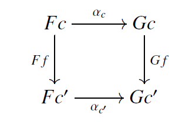
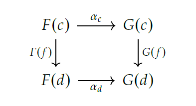
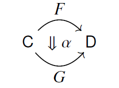

### natural transformation (Riehl)
- [[categories]]: C, D
- [[functors]]: $F, G: C \rightrightarrows D$ 
- natural transformation $\alpha_c : F(c)\rightarrow G(c) \in D$ for each object $c \in C$ (also called the c-component (Spivak & Fong)), the collection of which defines the components of the natural transformation such that for any morphism $f:c\rightarrow c^{\prime}$ the diagram commutes,

 meaning it has a common composite $F(c) \rightarrow G(c^{\prime})$ in D (the diagonal in this diagram)
"boundary data" needed to define the natural transform $\alpha$ 

$\alpha$ is kind of a wrapper: $\alpha(F: C \rightarrow D) = G: C \rightarrow D$ where the diagram commutes for any morphism $f:c\rightarrow c^{\prime}$ 

natural isomorphism: $\alpha:F \rightarrow G$ is called a natural isomorphism if each component $\alpha_c$ is an isomorphism in $\D$ 
