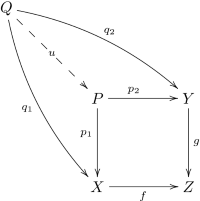
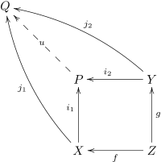

# pullback
- precomposition of a function 
  - f(y(x)) = g(x)
- acts on the argument
- [[category-limit]]
    - $P = X \times_{Z} Y $
- product is pullback w/ z= [[category-terminal]]

\

# pullback bundle
- Given a bundle p:E→Xp \colon E \to X, and a morphism f:Y→Xf \colon Y \to X, then the pullback bundle f *E→Yf^\ast E \to Y is (if it exists) simply the pullback of pp along ff, regarded as a bundle over YY. [nlab]
# pushforward/pushout 
- post composition of a function
- acts on the return
- [[category-colimit]]
  - $P = X \sqcup_{Z} Y$
- coproduct is pushout from [[category-initial]]
