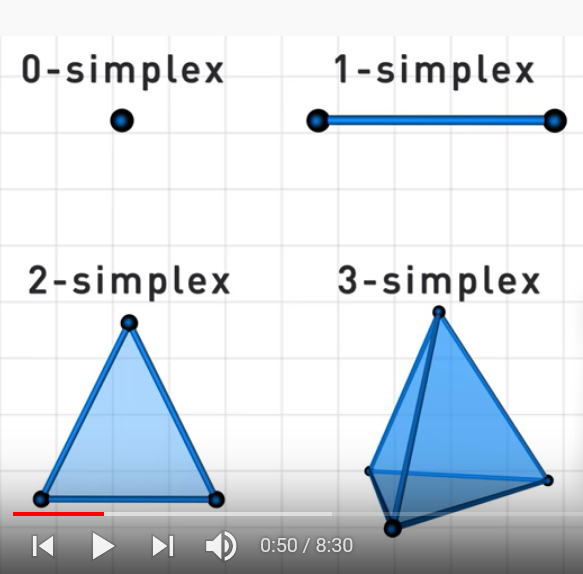

### simplicial complex (Spanier)
Simplicial complex K consists of 
- [[set]] $\{v\}$ of vertices $v$
- set $\{s\}$ of finite non-empty subsets of $\{v\}$ called simplexes s.t.
  - a) any set consisting of exactly one vertex is a simplexes
  - b) any nonempty subset of a simplex is a simplex

# https://www.youtube.com/watch?v=rlI1KOo1gp4&list=RDLVrlI1KOo1gp4&start_radio=1&rv=rlI1KOo1gp4&t=0

simplex: generalized triangle
    - 0D vertices
    - 1D edges
    - 2D faces
    - 3D solids
    - 4D spaces between solids?
k-simplex
    - k + 1 vertices
    - spaces between them (convex hull)
  
complete graph on k vertices = (k-1) simplex

simplacial complex is set of simplicies considered one unit 
    - can be individual/independent 
    - if stuck together, must be along whole vertex, edge, face, etc.

### skeleton
- a $p$ skeleton is a simplacial subcomplex of K that is a collection of simplices of K of dimension at most $p$, denoted $K^{(p)}$ (wolfram)

Lecture notes (Shewchuck)
- subcomplex is subset of simplacial complex that is iteself a simplacial complex. 
- $\varnothing$ is a face of every simplex, and to enforce this faces and simplicies are added to the subset.
- closure of the subset: smallest subset $L\subseteq K$ that contains L.
- a particular subcomples is the i-skeleton that consists of all simplicies $\sigma \in K$ whose dimension is i or less. 
- the dimension of K is the largest dimension of any simplex $\sigma$: $dim K = max\{dim\; \sigma\}$

simplicial set (nlab)
- combinatorial space built up by gluing abstract simplicies to each other
- simplacial set X is a collection of sets $S_n$ for $n\in \mathbb{N}$ s.t. elements in $S_n$ are n-simplicies with a rule that says:
- which (n-1)-simplicies in S_{n-1} are faces of which elements in $S_n$
- which (n+1) simplicies are thin:n-simplices regarded as degenerate (n+1) simplices 
[[nerve]] of a small category is a simplicial set