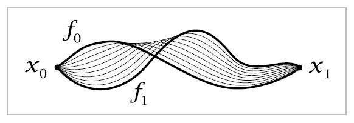

### path (hatcher)
path in [[topological-space]] X is a [[continous-map]] $f:I \rightarrow X$ where I is the unit interval [0,1]. 

A [[homotopy]] of paths in X is a family of functions $f_t:I\rightarrow X, 0\leq t \leq 1$ s.t.:
- endpoints $f_t(0)=x_0$, $f_t(1)=x_1$ are independent of t
- the associated map [[functors|functor]] $F: I \times I \rightarrow X$, \; $F(s,t) = f_t(s)$ is continous
When two paths $f_0, f_1$ are connected via a homotopy $f_t$, they are homotopic $f_0\cong f_1$

Path connectedness is the existence of paths connecting every pair of points.  